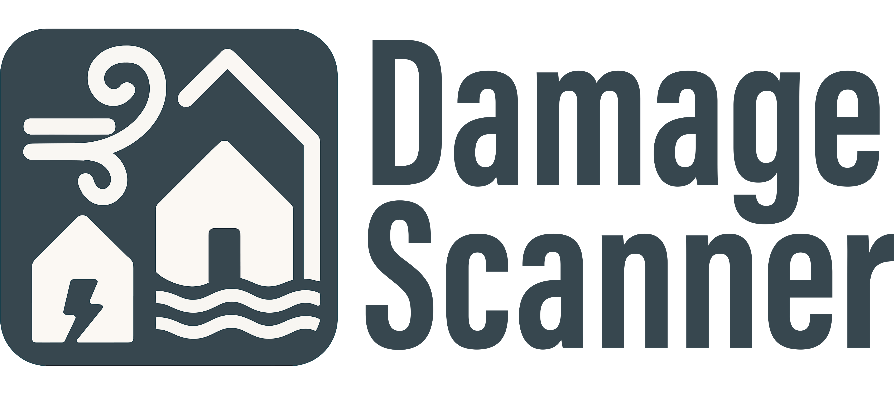
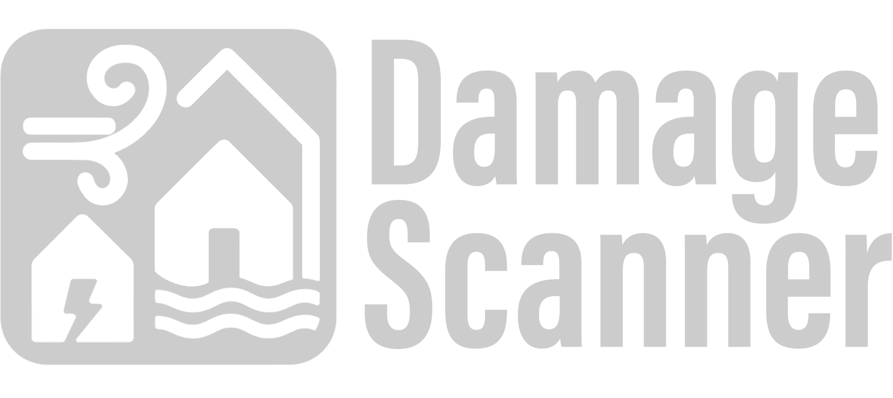

  
  

# DamageScanner: direct damage assessments for natural hazards

A python toolkit for direct damage assessments for natural hazards. Even though the method is initially developed for flood damage assessments, it can calculate damages for any hazard for which you just require a vulnerability curve (i.e. a one-dimensional relation). 

**Please note:** This package is still in development phase. In case of any problems, or if you have any suggestions for improvements, please raise an *issue*. 

## 🔑 Key Features

- ⚡ **Modular design** — Choose between raster-based or vector-based workflows
- 📦 **Out-of-the-box methods** — for exposure loading, raster-vector overlays, and damage estimation
- 🧠 **Damage functions** — Apply your own vulnerability curves with flexible input formats
- 🗺️ **Open geospatial stack** — Built on GeoPandas, Rasterio, Shapely, and more
- 🧪 **Easy API access** — Use the Python interface directly or integrate into notebooks

## 📖 Background

This package is (loosely) based on the original DamageScanner, which calculated potential flood damages based on inundation depth and land use using depth-damage curves in the Netherlands. The DamageScanner was originally developed for the 'Netherlands Later' project [(Klijn et al., 2007)](https://www.rivm.nl/bibliotheek/digitaaldepot/WL_rapport_Overstromingsrisicos_Nederland.pdf). The original land-use classes were based on the Land-Use Scanner in order to evaluate the effect of future land-use change on flood damages. 

## 🚀 Quickstart

1. Open the python environment in your command prompt or bash in which you want to install this package.
2. Type ``pip install damagescanner`` and it should install itself into your python environment.
3. Now you can import the package like any other package!

## 📄 License

This project is licensed under the MIT License. See the [LICENSE](https://github.com/VU-IVM/DamageScanner/blob/master/LICENSE) file for details.

