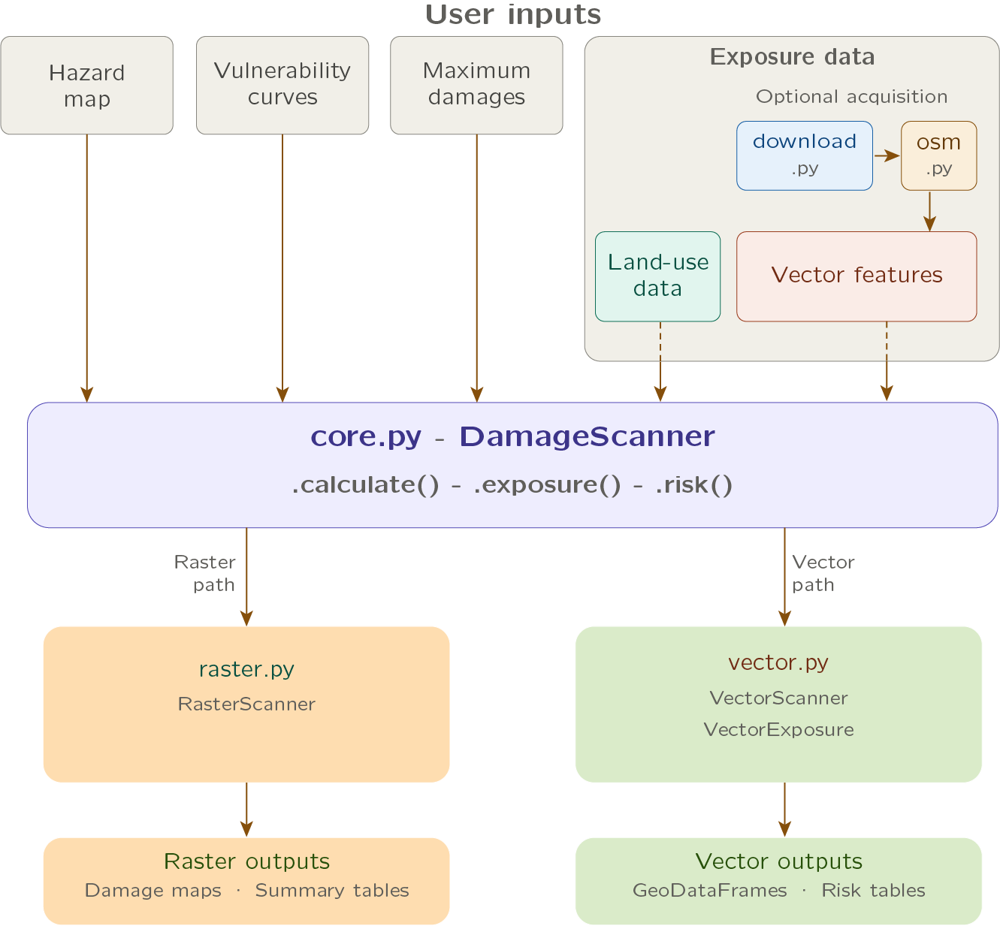

# Summary

The severity and frequency of natural hazards is increasing globally [@ipcc2023]. A good understanding of the risk to buildings and assets to, for example, extreme precipitation, record-breaking temperatures, and severe landslides is essential to develop evidence-based risk-reducing measures. To do so, we require easy-to-use and hazard-agnostic tools that allow us to compute the natural hazard risk for any place in the world. This could either be a local rainfall event, or a large-scale earthquake event. While the magnitude and intensity of such events differ greatly, the computational workflow to estimate those impact do not. As such, the `DamageScanner` has been developed as a simple and ready-to-use framework to allow exposure, damage and risk assesments either through user-defined input, or simply using public data as a starting point. 

# Statement of need

The `DamageScanner` is a Python package to perform exposure, damage and risk assessments for natural hazards and climate extremes. It allows users to easily perform a risk assessment for both vector and raster data through a single computational framework. The `DamageScanner` is designed to be used by both researchers, hazard risk modellers, and by students in (introductory) courses on geospatial analysis and natural hazard risk modelling. It has already been used in a number of scientific publications [@Koksetal2019 ; @KoksHaer2020], European projects [@MIRACA:2026] and integrated into other python packages (e.g., `GEB`).   

# State of the field         

Several open-source tools exist for natural hazard risk assessments, of which the `climada` framework [@Aznar2019; @Bresch2021] is one of the most well-known open-source tools. The `climada` framework is a widely-used Python ecosystem to perform large-scale risk assessment for various hazards. It allows for a multitude use cases and contains a wide range of submodules to tailor specific needs within the natural hazard risk domain [@Muhlhofer2023 ; @Riedel2024]. All of which is maintained by dedicated software engineers. While the `climada` framework is commendable and is used widely, the large ecosystem and the many dependencies within the several submodules also make it less flexible for integration within our own use cases. 

As such, the `DamageScanner` was built, rather than contributing to existing projects such as the `climada` framework, for several reasons. Firstly, the `DamageScanner` has been developed organically to tailor specific use cases within a multitude of projects. For example, the original `DamageScanner` was built to perform raster-based damage asssessment, mostly using land use information, in combination with flood hazard maps [@DeMoel2021]. The current generation of the `DamageScanner` has been build to be integrated into several infrastructure risk and resilience modelling pipelines, such as [@Koksetal2019, @VanOosterhout2023, @Ye2024].   

Secondly, with the rise of publicly-available object-based data, in particular due to OpenStreetMap (OSM), a need arose to efficiently perform large-scale object-based damage calculations [@VanGinkel2021; @Koksetal2019]. These object-based damage and risk assessment are, however, much more computational intensive. The `DamageScanner` fills a gap here, to provide an open-access approach to easily perform such risk assessment on top of existing object information (see Section [softwaredesign] for a an explanation of this workflow).

Thirdly, geospatial information of natural hazards and climate extremes are stored in a range of different formats. Ranging from GeoTiffs and netCDFs, to vector-based representations of earthquake intensities and flood depths. To model the impacts across those hazards within the same modelling framework, a tool was needed that can readily read and use different data storage formats. 

# Software design

The `DamageScanner`'s core design philosophy is focused on simplicity. In its most simple form (as described in \autoref{fig:figure1}), the user only needs to define four key inputs: (i) a list of objects and/or a land-use map, (ii) a hazard map, (iii) a list of maximum damages for the unique set of objects or land uses considered in the analysis, and (iv) a set of vulnerability or fragility curves that describe the relation between the hazard intensity metric (e.g., the flood depth or the wind speed) and the potential impact to the specific objects or land uses in the applied assessment. 

{width="90%"}

The `DamageScanner` can directly read hazard information provided a GeoTIFF and NetCDF files, either pre-loaded through the `xarray` package, or with a file path provided. Hazard data can either be (high-resolution)  proprietary data, or taken from the public domain (e.g., JRC global flood maps, @Baugh2024). It is recommended to clip the hazard data to the area of interest before running the `DamageScanner`. 

For the vulnerability curves, the `DamageScanner` can read the data as different file formats. Essential is the structure of the data. The first column should always represent the hazard intensity that corresponds with the hazard information (e.g., centimeters of inundation, maximum gust speeds in m/s). The following columns should then provide one or multiple vulnerability curve for each object/element considered in the analysis (e.g., different road, building or land-use types). Most vulnerability information is structured in such a manner [@Nirandjan2024].

For the maximum damages, a file structure should be provided which links each object/element within the analysis to its maximum reconstruction/replacement value. The recommended structure is a left column with each object/element, and a right column with this maximum damage value. 

The final piece of input information is the exposure data. Depending on the data type, the `DamageScanner` automatically decides whether it will be a raster or a vector-based damage assessment. Given its wide-use in OSM-based damage and risk assessments, the `DamageScanner` allows to directly read OSM data through the `download.py` and `osm.py` scripts. Vector data can contain (Multi)Polygon, (Multi)LineString or Point geometries. It is important to ensure that the maximum damage values reflect these geometries types. More specifically, objects stored as Polygons will require maximum damage values in m2, objects stored as LineStrings will require maximum damages values in meters, whereas objects stored as Points will require maximum damage values for the entire object.

Finally, if multiple return periods are available within the hazard data, one can estimate the potential natural hazard risk, which is computed as the area under the probability-exceedence loss curve through a trapezoid approach. The code-snippet below provides an example of the direct use of the `DamageScanner`.

```python
from damagescanner.core import DamageScanner

# Paths to input files
hazard = "path/to/hazard_data.tif"
feature_data = "path/to/exposure_data.shp"
curves = "path/to/vulnerability_curves.csv"
maxdam = "path/to/maxdam.csv"

# Initialize
scanner = DamageScanner(hazard, feature_data, curves, maxdam)

# Curves and maxdam must be empty DataFrames for exposure-only
scanner = DamageScanner(hazard, feature_data, pd.DataFrame(), pd.DataFrame())
exposed = scanner.exposure()

# Damage Assessment
damage_results = scanner.calculate()

# Risk
hazard_dict = {
    10: "hazard_10.tif",
    50: "hazard_50.tif",
    100: "hazard_100.tif"
}

risk_results = scanner.risk(hazard_dict)

```

When running the `DamageScanner`, it is important to be aware of several potential issues. The first, and most common issue when running the `DamageScanner` is consistency in the Coordinate Reference System (CRS). To reduce the risk of a potentially unsuccesful completion, it is recommended to ensure that both hazard and exposure information is stored in the same CRS.  The second common issue relates to multiple geometries of the same object type. For example, when using OSM data, school facilities can be stored as both Points or Polygons. However, the maximum damages for a specific asset type can only refer to only geometry type (i.e., either damages per square meter, or per entire asset). As such, one either needs to convert all assets of the same object type into the same geometry type, or one should make unique object types for the different geometry types (and match maximum damages accordingly).

# Research impact statement

The `DamageScanner` has demonstrated significant research impact and grown both its user base
and contributor community since its initial release in 2019. It has been the basis of several academic papers (e.g., @Koksetal2019, @VanOosterhout2023, @Ye2024) and European and international research projects (e.g., Horizon Europe MIRACA and Ticca4Danu).  


# AI usage disclosure
Generative AI tools were used to support the development of the test environment for the `DamageScanner`, the docstrings throughout the package, and the preliminary versions of Figure 1. 

# Acknowledgements
This project has received funding from the European Union’s Horizon Europe research and innovation programme (Grant Agreement No. 101093854), NWO Dutch Research Council (Veni Grant No. VI.Veni.194.033), the World Bank and the Asian Development Bank.

# References
